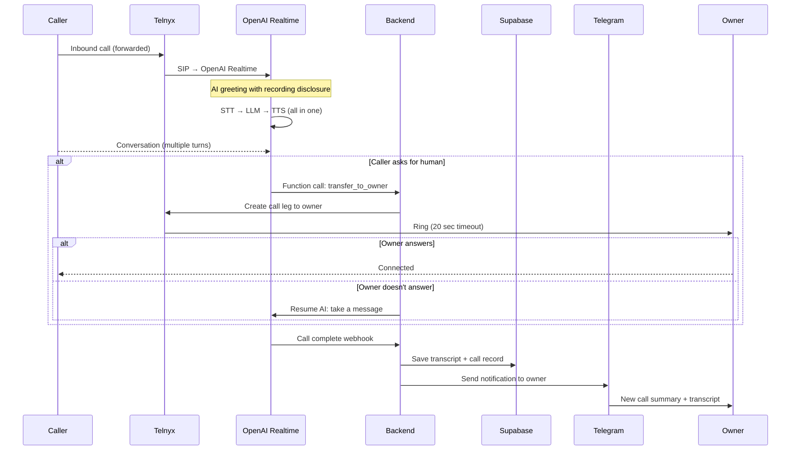
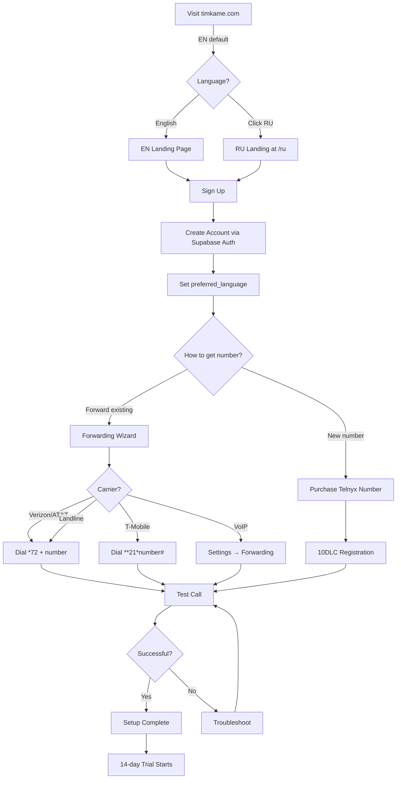
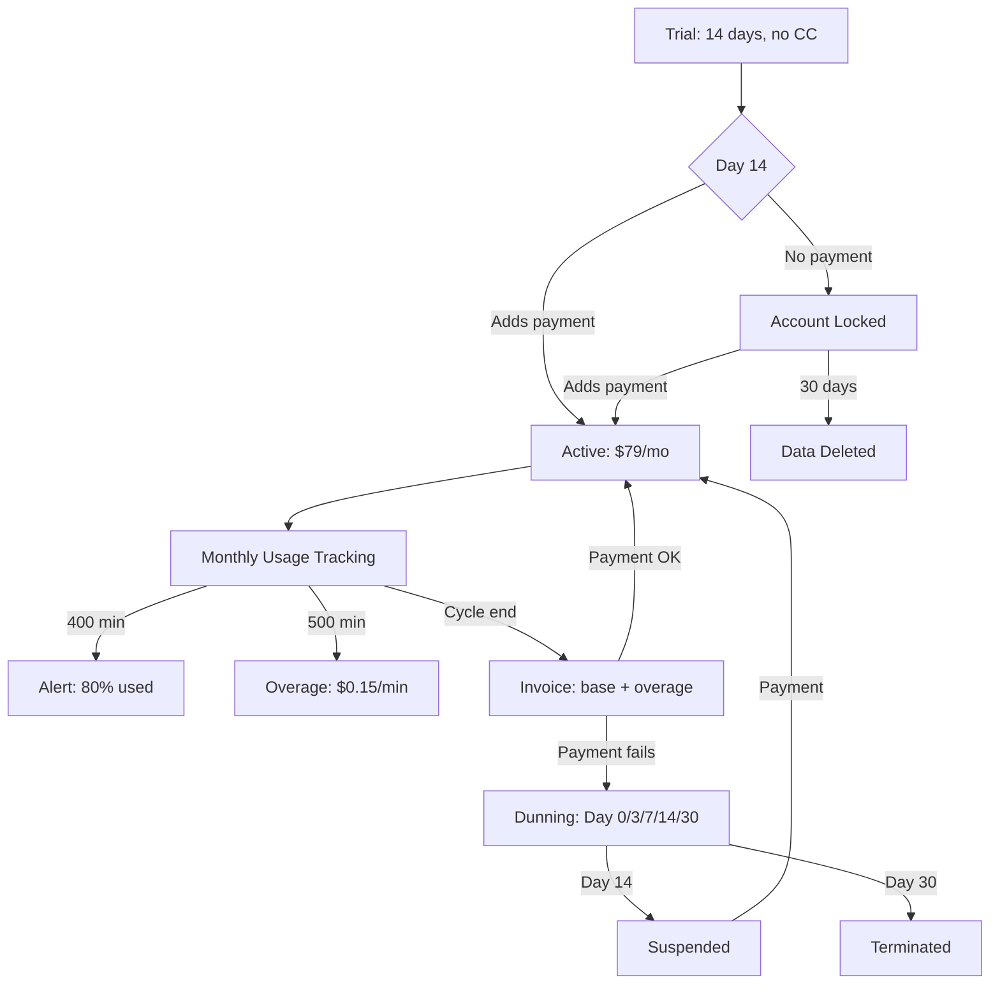
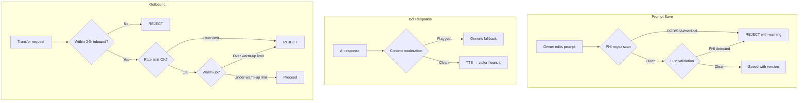

# Target Architecture — TimkaMe v6

> Phase C deliverable. Decision-dense, no theory padding. Compiled 04/18/2026.

## Краткое резюме (RU)

Архитектура v6 — полностью новый стек, заточенный под solo founder с бюджетом <$100/мес.

**Ключевые решения:**
- **Голос:** OpenAI Realtime через прямой Telnyx SIP (тест пройден 04/18/2026, русский ОК). Без Pipecat, без middleware — простейший вариант, ~450-900ms задержка
- **Телефония:** Telnyx pay-as-you-go (НЕ managed accounts — $1K/мес минимум не подходит). Inbound ~$0.004/мин
- **Backend:** TypeScript + Hono на Hetzner US (Ashburn), $12.77/мес за 3 vCPU / 4GB RAM
- **БД + Auth:** Supabase free tier (RLS для мультитенанта, Auth из коробки, 500MB бесплатно)
- **Оркестрация:** Inngest вместо n8n (50K запусков/мес бесплатно, код в Git, тестируемый)
- **Frontend:** Next.js 15 App Router (сохраняем дизайн admin panel)

**Стоимость:**
- Фаза разработки (0 клиентов): ~$14/мес
- 10 клиентов: ~$135/мес (из них ~$95 — Telnyx + OpenAI, пропорционально выручке)
- 50 клиентов: ~$656/мес при выручке $3,950/мес

**Что требуется от Евгения:** прочитать STACK-REVIEW.md и подтвердить стек перед стартом Phase 0.

---

## C.1 — Stack Table

| Layer | Choice | Why | $0 cust/mo | $10 cust/mo | $50 cust/mo |
|-------|--------|-----|-----------|-------------|-------------|
| **Telephony** | Telnyx PAYG ✅ LOCKED | PAYG approved (DEC-006). $0.0035/min inbound. App-layer tenant isolation via RLS. | $1 (1 test number) | ~$35 | ~$175 |
| **Voice AI** | OpenAI Realtime via Telnyx SIP ✅ LOCKED | A.4 gate PASSED. Direct SIP, no middleware. 450-900ms response. | $0 (testing) | ~$60 | ~$300 |
| **Backend** | TypeScript + Hono on Hetzner | Hono: 2x faster than Express, 10x smaller. Hetzner US (Ashburn): $12.77/mo for 3 vCPU, 4GB. No cold starts. | $12.77 | $12.77 | $24.99 |
| **Frontend** | Next.js 15 (App Router) | Preserves existing admin design. SSR for landing SEO. | (same server) | (same server) | (same server) |
| **Database** | Supabase (free tier) | RLS built-in. Auth built-in. 500MB + 50K MAU free. PITR available. | $0 | $0 | $25 (Pro) |
| **Auth** | Supabase Auth | Free, built into DB. Google/email login. JWT tokens. | $0 | $0 | $0 |
| **Workflow orchestration** | Inngest (free tier) | 50K runs/mo free. Zero infra. Replaces n8n without Redis dependency. | $0 | $0 | $0 |
| **Error tracking** | Sentry (free tier) | 5K errors/mo free. Industry standard. | $0 | $0 | $0 |
| **Email** | Resend (free tier) | 3K emails/mo free. DKIM/SPF built-in. | $0 | $0 | $0 |
| **CI/CD** | GitHub Actions | Free for public repos. 2000 min/mo private. | $0 | $0 | $0 |
| **Secrets** | Doppler (free tier) | Free for 1 user. CLI + CI integration. | $0 | $0 | $0 |
| **Analytics** | PostHog (free tier) | 1M events/mo free. Session recording. Feature flags. | $0 | $0 | $0 |
| **Status page** | Upptime (GitHub Actions) | Free. GitHub Pages. EN + RU. | $0 | $0 | $0 |
| **CDN/DNS** | Cloudflare (free) | Already configured. SSL. DDoS protection. | $0 | $0 | $0 |
| **Domain** | timkame.com | Already owned. | ~$1.25 | ~$1.25 | ~$1.25 |
| **Payments** | Stripe (transaction %) | 2.9% + $0.30 per transaction. No monthly fee. | $0 | ~$26 | ~$130 |
| | | | | | |
| **TOTAL** | | | **~$14** | **~$135** | **~$656** |

### Budget check

| Customers | Total infra | Revenue | Profitable? |
|-----------|-----------|---------|-------------|
| 0 | ~$14/mo | $0 | ✅ Under $100 ceiling |
| 5 | ~$80/mo | $395 | ✅ Under $100, profitable |
| 10 | ~$135/mo | $790 | ✅ Under $300, profitable |
| 50 | ~$656/mo | $3,950 | ✅ Well within revenue |

**At 10 customers:** $135/mo is above $100 target but below $300 ceiling. The gap is almost entirely Telnyx voice costs ($35) and OpenAI voice costs ($60) which are directly proportional to usage and covered by subscription revenue. Fixed infra costs are ~$14/mo.

### Telnyx pricing details (researched 04/18/2026)

| Item | Cost |
|------|------|
| Inbound voice (US local DID) | ~$0.004/min (Voice API $0.002 + SIP trunking ~$0.002) |
| Outbound voice (US) | ~$0.007-0.009/min |
| Local phone number | $1.00/mo |
| 10DLC brand registration | $4 one-time |
| 10DLC campaign vetting | $15 one-time |
| 10DLC campaign monthly | $2-10/mo per campaign |

**Telnyx AI Accelerator:** $20,000 in AI credits + 3 months engineering support. Requires working prototype. Worth applying.

### Hard calls — defended

**n8n → Inngest:** n8n has 37 workflows, not version-controlled, not testable, requires separate server process, UI-based editing is fragile for a solo founder who should have code-level control. Inngest is code-first, TypeScript, 50K free runs/mo, zero infra. Rewriting 37 workflows as TypeScript functions is ~20-30 hours but produces testable, version-controlled business logic. Trade: lost visual workflow editor. Gain: type safety, testability, git history.

**Supabase stays:** RLS is the entire multi-tenant security story. Auth is free and solid. 500MB free tier handles months of data. PostgreSQL as the database is boring and correct. Alternative (PlanetScale, Neon) would add cost without adding value we need.

**Hetzner US over managed platforms:** Hetzner CPX21 in Ashburn = $12.77/mo for 3 vCPU, 4GB RAM. Fly.io equivalent = ~$31/mo. Railway = usage-based unpredictable. Render = $7/mo but 0.5 CPU. Hetzner wins on price/performance. Trade: ops burden (no auto-deploy, no managed runtime). Gain: 3x more compute for less money, no cold starts, US East location for low latency to Telnyx/OpenAI.

**Coolify on Hetzner:** Viable for git-push deploys + auto-SSL. 325K+ users. But 11 critical CVEs in Jan 2026. Decision: start with simple PM2 + GitHub Actions deploy (familiar from current setup). Evaluate Coolify after 3 months if ops burden is too high.

**OpenAI Realtime over hybrid pipeline:** Direct Telnyx SIP → OpenAI eliminates entire middleware layer (~800 lines). 450-900ms response time. One vendor for STT+LLM+TTS. Trade: locked to OpenAI for all voice processing. If Russian quality fails (A.4), fall back to hybrid (Deepgram STT + GPT-4.1 + ElevenLabs TTS) which requires middleware. **Decision blocked on A.4 gate.**

### Telnyx SIP → OpenAI Realtime (confirmed)

Direct SIP routing is confirmed and documented by OpenAI:
1. Create webhook in platform.openai.com for incoming calls
2. Point Telnyx SIP trunk at: `sip:$PROJECT_ID@sip.api.openai.com;transport=tls`
3. OpenAI receives SIP traffic, fires webhook, handles STT+LLM+TTS natively
4. Latency: 450-900ms time-to-first-voice, 180-300ms first-token

---

## C.2 — System Diagrams

### 1. Call Flow



### 2. Onboarding Flow



### 3. Billing Flow



### 4. Safeguards Flow



---

## C.3 — Data Model

### Tables

```sql
-- Tenant root
CREATE TABLE organizations (
  id UUID PRIMARY KEY DEFAULT gen_random_uuid(),
  name TEXT NOT NULL,
  slug TEXT UNIQUE NOT NULL,
  owner_id UUID NOT NULL REFERENCES auth.users(id),
  preferred_language TEXT NOT NULL DEFAULT 'en' CHECK (preferred_language IN ('en', 'ru')),
  timezone TEXT NOT NULL DEFAULT 'America/New_York',
  subscription_status TEXT NOT NULL DEFAULT 'trial'
    CHECK (subscription_status IN ('trial', 'active', 'past_due', 'suspended', 'terminated')),
  trial_ends_at TIMESTAMPTZ,
  current_period_end TIMESTAMPTZ,
  minutes_used INTEGER NOT NULL DEFAULT 0,
  minutes_included INTEGER NOT NULL DEFAULT 500,
  stripe_customer_id TEXT,
  stripe_subscription_id TEXT,
  telnyx_connection_id TEXT,
  telegram_chat_id TEXT,
  owner_phone TEXT,
  transfer_timeout_sec INTEGER NOT NULL DEFAULT 20,
  created_at TIMESTAMPTZ NOT NULL DEFAULT NOW(),
  updated_at TIMESTAMPTZ NOT NULL DEFAULT NOW()
);

-- Users (extends Supabase auth.users)
CREATE TABLE user_profiles (
  id UUID PRIMARY KEY REFERENCES auth.users(id),
  org_id UUID NOT NULL REFERENCES organizations(id),
  preferred_language TEXT NOT NULL DEFAULT 'en' CHECK (preferred_language IN ('en', 'ru')),
  role TEXT NOT NULL DEFAULT 'owner' CHECK (role IN ('owner', 'admin', 'viewer')),
  created_at TIMESTAMPTZ NOT NULL DEFAULT NOW()
);

-- Phone numbers (Telnyx)
CREATE TABLE phone_numbers (
  id UUID PRIMARY KEY DEFAULT gen_random_uuid(),
  org_id UUID NOT NULL REFERENCES organizations(id),
  phone_number TEXT NOT NULL UNIQUE,
  telnyx_number_id TEXT NOT NULL,
  forwarding_from TEXT,
  cnam_registered BOOLEAN NOT NULL DEFAULT FALSE,
  provisioned_at TIMESTAMPTZ NOT NULL DEFAULT NOW(),
  warmup_ends_at TIMESTAMPTZ,
  status TEXT NOT NULL DEFAULT 'active' CHECK (status IN ('active', 'suspended', 'released'))
);

-- Calls
CREATE TABLE calls (
  id UUID PRIMARY KEY DEFAULT gen_random_uuid(),
  org_id UUID NOT NULL REFERENCES organizations(id),
  phone_number_id UUID REFERENCES phone_numbers(id),
  caller_phone TEXT NOT NULL,
  direction TEXT NOT NULL DEFAULT 'inbound' CHECK (direction IN ('inbound', 'outbound')),
  status TEXT NOT NULL DEFAULT 'in_progress'
    CHECK (status IN ('in_progress', 'completed', 'error', 'transferred')),
  duration_seconds INTEGER,
  billable_minutes INTEGER,
  transcript JSONB,
  summary TEXT,
  caller_name TEXT,
  caller_reason TEXT,
  transfer_attempted BOOLEAN NOT NULL DEFAULT FALSE,
  transfer_succeeded BOOLEAN,
  first_response_ms INTEGER,
  turn_latency_ms INTEGER,
  language_detected TEXT,
  telnyx_call_id TEXT,
  created_at TIMESTAMPTZ NOT NULL DEFAULT NOW()
);

-- Prompts (versioned)
CREATE TABLE prompts (
  id UUID PRIMARY KEY DEFAULT gen_random_uuid(),
  org_id UUID NOT NULL REFERENCES organizations(id),
  version INTEGER NOT NULL DEFAULT 1,
  greeting TEXT NOT NULL,
  instructions TEXT NOT NULL,
  language TEXT NOT NULL DEFAULT 'en' CHECK (language IN ('en', 'ru', 'es')),
  phi_scan_passed BOOLEAN NOT NULL DEFAULT TRUE,
  is_active BOOLEAN NOT NULL DEFAULT TRUE,
  created_at TIMESTAMPTZ NOT NULL DEFAULT NOW(),
  created_by UUID REFERENCES auth.users(id),
  UNIQUE(org_id, version)
);

-- Notifications queue
CREATE TABLE notifications (
  id UUID PRIMARY KEY DEFAULT gen_random_uuid(),
  org_id UUID NOT NULL REFERENCES organizations(id),
  call_id UUID REFERENCES calls(id),
  channel TEXT NOT NULL CHECK (channel IN ('telegram', 'email')),
  status TEXT NOT NULL DEFAULT 'pending'
    CHECK (status IN ('pending', 'sent', 'delivered', 'failed')),
  payload JSONB NOT NULL,
  sent_at TIMESTAMPTZ,
  error TEXT,
  created_at TIMESTAMPTZ NOT NULL DEFAULT NOW()
);

-- Rate limits
CREATE TABLE rate_limits (
  id UUID PRIMARY KEY DEFAULT gen_random_uuid(),
  org_id UUID NOT NULL REFERENCES organizations(id),
  limit_type TEXT NOT NULL CHECK (limit_type IN ('outbound_call', 'outbound_sms', 'api_request')),
  period TEXT NOT NULL DEFAULT 'day' CHECK (period IN ('minute', 'hour', 'day')),
  max_count INTEGER NOT NULL,
  current_count INTEGER NOT NULL DEFAULT 0,
  window_start TIMESTAMPTZ NOT NULL DEFAULT NOW(),
  UNIQUE(org_id, limit_type, period)
);

-- Audit log
CREATE TABLE audit_log (
  id UUID PRIMARY KEY DEFAULT gen_random_uuid(),
  org_id UUID NOT NULL REFERENCES organizations(id),
  user_id UUID REFERENCES auth.users(id),
  action TEXT NOT NULL,
  resource_type TEXT NOT NULL,
  resource_id TEXT,
  details JSONB,
  ip_address INET,
  created_at TIMESTAMPTZ NOT NULL DEFAULT NOW()
);
```

### Indexes

```sql
CREATE INDEX idx_calls_org_created ON calls(org_id, created_at DESC);
CREATE INDEX idx_calls_caller_phone ON calls(caller_phone);
CREATE INDEX idx_notifications_org_status ON notifications(org_id, status);
CREATE INDEX idx_audit_log_org_created ON audit_log(org_id, created_at DESC);
CREATE INDEX idx_phone_numbers_org ON phone_numbers(org_id);
CREATE INDEX idx_prompts_org_active ON prompts(org_id) WHERE is_active = TRUE;
```

### RLS Policies

```sql
ALTER TABLE organizations ENABLE ROW LEVEL SECURITY;
ALTER TABLE user_profiles ENABLE ROW LEVEL SECURITY;
ALTER TABLE phone_numbers ENABLE ROW LEVEL SECURITY;
ALTER TABLE calls ENABLE ROW LEVEL SECURITY;
ALTER TABLE prompts ENABLE ROW LEVEL SECURITY;
ALTER TABLE notifications ENABLE ROW LEVEL SECURITY;
ALTER TABLE rate_limits ENABLE ROW LEVEL SECURITY;
ALTER TABLE audit_log ENABLE ROW LEVEL SECURITY;

-- Pattern (repeated for all tables)
CREATE POLICY "Users access own org data"
  ON calls FOR ALL
  USING (org_id IN (
    SELECT org_id FROM user_profiles WHERE id = auth.uid()
  ));
```

---

## C.4 — Multi-Tenant Boundary

**Principle:** RLS-implicit `org_id` scoping. No app-layer filtering.

Every table has `org_id`. Every query goes through Supabase client with JWT. RLS ensures no cross-tenant data leakage without any application code.

**Pattern:**
```typescript
// CORRECT — RLS handles isolation
const { data } = await supabase
  .from('calls')
  .select('*')
  .order('created_at', { ascending: false });
// JWT → RLS → only tenant's calls returned

// WRONG — DO NOT DO THIS
const { data } = await supabase
  .from('calls')
  .select('*')
  .eq('org_id', currentOrgId); // redundant AND dangerous if RLS missing
```

**Cross-tenant isolation test (required in CI):**
```typescript
test('user A cannot read user B calls', async () => {
  const clientA = createClient(URL, ANON_KEY, {
    global: { headers: { Authorization: `Bearer ${tokenA}` } }
  });
  const { data } = await clientA.from('calls').select('*');
  expect(data.every(c => c.org_id === orgA.id)).toBe(true);
});
```

---

## C.5 — Content Blocks System

### Chosen: Option B — MDX + shared data files

**Why:** Solo founder + <$100/mo + learning-first → code-first content management.

- Type-safe: TypeScript catches missing/wrong fields at build time
- Git-versioned: every content change has commit history
- No extra infra: no CMS to host, no API to cache
- Build-time: `$` + digits outside `/content/data/pricing.*` = build failure (ESLint rule)

**Trade-off:** Copy changes require a deploy. Acceptable at <50 pages.

### File structure
```
content/
  data/
    pricing.ts      # $79, 500 min, $0.15 overage — SINGLE SOURCE
    features.ts     # Feature list items
    heroes.ts       # Hero sections per page
    testimonials.ts # Social proof
    faq.ts          # FAQ items
    cta.ts          # Call-to-action blocks
    trust.ts        # Trust signals
    legal-footer.ts # ToS/Privacy links
```

### Example
```typescript
export const pricing = {
  plan: {
    name: { en: 'AI Receptionist', ru: 'AI-Ресепшн' },
    price: 79,
    currency: 'USD',
    interval: 'month',
    minutesIncluded: 500,
    overagePerMinute: 0.15,
    trial: { days: 14, minutes: 50, requiresCard: false },
  },
} as const;
```

### Language-aware routing

- `/` → English landing (default for all visitors)
- `/ru` → Russian landing (separately authored, not translated)
- Header: prominent "RU / Русский" button (EN side) / "EN / English" (RU side)
- No auto-redirect based on browser language
- `hreflang` tags both ways, sitemap includes both
- App dashboard: per-user `preferred_language`, bot language is per-tenant (independent)

### Migration plan
1. Audit all 50+ pages for hardcoded prices/features/claims
2. Extract to `/content/data/` TypeScript files
3. Replace page-by-page with imports
4. Add ESLint rule: `$\d+` outside `/content/data/` = build failure
5. Verify: no hardcoded prices remain
